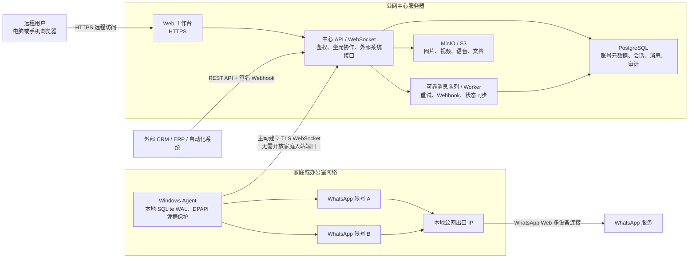

# RelayDesk

> Windows Agent 的安装包发布、注册、扫码和断网恢复验收见 [`docs/windows-agent.md`](docs/windows-agent.md)。VPS 已上线后，建议先按该文档用测试 WhatsApp 账号完成一轮端到端验证，再接入正式账号。

## 远程连接方式与部署架构

RelayDesk 采用“公网中心服务器 + 家庭/办公室 Windows Agent”的边缘执行架构。你在外部访问中心服务器上的 Web 工作台，中心服务器负责身份验证、消息存储、API、队列和坐席协作；真正连接 WhatsApp 并执行收发操作的是家里或办公室电脑上的 Windows Agent。

Windows Agent 会主动向中心服务器建立加密的 HTTPS/WSS 出站连接，因此家庭网络通常不需要公网 IP、端口映射或内网穿透。只需确保 Windows Agent 能访问中心服务器，并保持后台运行。



### 消息流向

发送消息时：

1. 远程用户或外部系统把发送请求提交到中心 API。
2. 中心服务器先将消息和发送命令持久化，再通过 WSS 派发给对应的 Windows Agent。
3. Windows Agent 使用目标账号的本地 WhatsApp 会话完成发送，并把发送、送达、已读或失败状态同步回中心服务器。
4. 如果 Agent 或家庭网络离线，命令保留在中心队列；Agent 恢复连接后继续按顺序处理。

接收消息时：

1. WhatsApp 消息先到达运行对应账号的 Windows Agent。
2. Agent 先写入本地 SQLite WAL，再同步到中心服务器。
3. 中心服务器事务落库后确认同步游标，并实时更新 Web 工作台及签名 Webhook。
4. 如果中心服务器暂时不可达，Agent 会保留未确认事件并在恢复后重传；中心通过事件 ID 和 WhatsApp 消息 ID 去重。

### IP 归属

- WhatsApp 连接使用 Windows Agent 所在网络的公网出口 IP，而不是中心服务器 IP。
- 多个 WhatsApp 账号运行在同一台 Windows Agent 上时，通常共用该电脑所在网络的公网出口 IP。
- 账号分布在不同电脑、不同住宅或不同办公室网络时，会分别使用各自网络的出口 IP。
- 如需更强隔离，可以为不同账号部署独立 Agent、Windows 虚拟机或稳定的独立网络出口。
- 不建议频繁切换代理、地区或出口 IP；账号网络环境应尽量稳定并符合实际使用地点，以降低 WhatsApp 风控风险。

### 安全边界

- WhatsApp 会话凭据保存在 Windows Agent 本地，通过 Windows DPAPI 保护，不上传到中心服务器。
- Agent 只主动连接中心服务器，不监听公网端口；中心使用一次性注册码登记 Agent，并换取可撤销的设备凭据。
- 公网只需暴露经过 HTTPS/WSS 反向代理的 Web/API；PostgreSQL、Redis 和 MinIO 不应直接暴露到互联网。
- 中心服务器故障不会改变 WhatsApp 账号的网络出口，但会暂时影响远程操作；Agent 会继续保存待同步事件。
- Windows Agent 关机、退出登录或家庭断网期间无法实时收发；恢复后会处理仍可由 WhatsApp 多设备协议交付的事件和中心待发送队列。

### 推荐部署示例

```text
云服务器（固定域名 + HTTPS）
├─ RelayDesk Web / API / Worker
├─ PostgreSQL
├─ Redis
└─ MinIO

家里 Windows 电脑
└─ RelayDesk Agent
   ├─ WhatsApp 账号 A
   ├─ WhatsApp 账号 B
   └─ 主动连接 wss://relay.example.com/agent/ws

远程访问
└─ https://relay.example.com
```

RelayDesk 是一个自托管的 WhatsApp 多账号消息聚合平台。它由中心 Web/API、持久任务 Worker、PostgreSQL、Redis、对象存储以及运行在 Windows 上的本地 WhatsApp Agent 组成。

> 本地账号连接使用社区维护的 WhatsApp Web 多设备协议，不是 Meta 官方 Cloud API。请只用于获得授权的业务会话，不要发送垃圾消息或批量营销内容。上游协议变化和账号风控无法由本项目完全消除。

## 已实现能力

- 中文四栏共享收件箱，会话筛选、搜索、联系人详情、新建单个号码会话、离线状态与发送排队反馈。
- 多坐席角色、账号权限、联系人、会话、消息、回执、标签、备注和审计数据模型。
- `/api/v1` 登录、账号/会话/消息查询、幂等发送、媒体上传、API Key、Webhook 和 Agent 注册接口。
- Web 左侧 Agent 管理页可查看设备版本、协议、在线状态、同步游标与绑定账号，并支持注册、重命名、撤销和删除。
- 中心与 Agent 的版本化 WebSocket 协议；PostgreSQL 发件箱与本地 SQLite WAL 共同提供至少一次传输和幂等落库。
- Windows Electron Agent、DPAPI 保护的本地主密钥、按账号子进程、扫码配对、断网重连和串行发送。
- Webhook HMAC-SHA256 签名、24 小时重试、人工重放；不确定发送会停止自动重试以避免重复消息。
- Docker Compose 单节点部署、健康检查、PostgreSQL/MinIO 持久卷和备份脚本。

## 本地启动

### 工作台预览

工作台不再注入演示账号、联系人或消息。页面必须登录中心 API，并只展示 PostgreSQL 中由 Windows Agent 同步的真实数据；没有会话时会显示真实空状态。若 Web 与 API 不同域，请在构建 Web 时设置 `NEXT_PUBLIC_RELAY_API_URL`，同时确保 API 的 `CORS_ORIGIN` 指向工作台域名。

历史版本曾通过 `002_seed_demo.sql` 写入 `Pharah House` 等演示记录。当前版本已移除该种子，并在中心 API 启动时自动删除这些固定 ID 的旧记录；不会删除真实账号或消息。

```powershell
npm install
npm run dev
```

访问 `http://localhost:3000`。

### 完整中心平台

复制 `.env.example` 为 `.env`，替换所有密码和密钥，然后执行：

```powershell
docker compose up --build -d
```

- 工作台：`http://localhost:3200`
- API：`http://localhost:8080`
- 健康检查：`http://localhost:8080/health`
- OpenAPI：`http://localhost:8080/api/v1/openapi.json`

首次启动会使用 `.env` 中的 `ADMIN_EMAIL` 和 `ADMIN_PASSWORD` 创建管理员。

### AI Agent、知识库与聊天记忆

管理员可在“系统设置 → AI Agent”中配置独立的 OpenAI/OpenAI-compatible Provider，并为每个 WhatsApp 账号设置人设、语言、营业时间、置信度阈值、24/72 小时跟进规则和可用知识库。功能默认关闭；只有完成 Provider 与知识库配置并明确开启账号后才会运行。

“系统设置 → 知识库”支持 PDF、DOCX、TXT、Markdown 和结构化常见问答。原始文档保存在 MinIO，后台 Worker 解析并通过 PostgreSQL/pgvector 建立混合检索索引。状态显示为“可用于回答”后，文档才会进入 Agent 上下文；删除文档或问答会同步移除检索内容。

Agent 只会在置信度达标、引用有效知识且不涉及退款、支付、投诉升级或订单修改时自动发送。其余结果会作为坐席草稿展示。坐席发送任何消息后，该会话进入人工接管并取消待跟进任务，必须在会话顶部手动点击“恢复 Agent”。客户回复、会话关闭/归档、成交或流失也会取消后续跟进。

联系人详情会展示滚动会话摘要和带来源的客户事实。事实可由坐席修改或删除；“重新整理”会排队重建摘要。完整消息历史仍保存在原有 `messages` 表中。

数据库升级会在 API 启动时自动应用 `014_ai_agent.sql`。部署使用带 pgvector 的 PostgreSQL 17 镜像；现有数据库卷会原地新增表和索引，不会清除历史会话。

### AI 双向翻译

管理员进入“系统设置 → AI 翻译”后，可配置 OpenAI 或同时实现 `/chat/completions`、`/audio/transcriptions` 的 OpenAI 兼容服务，并分别指定文字翻译与语音转写模型。OpenAI 的默认语音转写模型为 `gpt-4o-mini-transcribe`。翻译与文字转语音 Provider 相互独立；翻译服务同一时间只允许启用一个 Provider，API Key 使用 `DATA_ENCRYPTION_KEY` 加密保存且不会回传明文。

坐席可在会话输入区附件按钮右侧为当前会话开启 AI 翻译，并分别选择“收到消息译为”和“发送消息译为”的语言。每个会话拥有独立配置，偏好按“坐席 + 会话”保存在 PostgreSQL 中，会随同一坐席账号跨浏览器同步。收到的纯文本保留原文并在下方显示译文；收到的语音可从播放器下方手动触发转写与翻译，WhatsApp 的 OGG/Opus 语音会在服务端临时转为 Provider 支持的 MP3，原始媒体保持不变。文字译文按“消息 + 目标语言”缓存，语音转写按消息缓存且译文同样按目标语言缓存，跨浏览器不会重复调用已生成结果。发出文本先生成可编辑预览，只有确认后才会进入可靠消息队列。附件说明、图片 OCR 和新建会话首条消息不会自动翻译。

### AI 文字转语音

管理员登录 Web 工作台后，进入左下角“系统设置 → AI 语音 Provider”配置服务。当前支持 OpenAI、ElevenLabs、Azure Speech，以及实现 `/audio/speech` 的 OpenAI 兼容接口。API Key 使用 `DATA_ENCRYPTION_KEY` 加密保存到 PostgreSQL，读取配置时只返回是否已配置，不回传密钥明文；不需要在 `.env` 中保存 Provider API Key。

进入任意会话后，点击输入框右侧的麦克风按钮，可以输入最多 4096 个字符并设置语速和语气。中心 API 会通过当前启用的 Provider 生成 OGG/Opus 或 MP3 音频、保存到媒体库，再通过现有的可靠消息队列交给 Windows Agent；Agent 会将它作为 WhatsApp 语音消息发送。系统同一时间只允许启用一个 Provider。

### Windows Agent

Agent 安装包以 `apps/agent/package.json` 的版本为准。版本文件合入 `main` 后，GitHub Actions 会构建并校验安装包内的版本徽标、renderer、preload 桥接和固定用户数据目录，然后自动创建对应的 `agent-v*` GitHub Release。不要从旧 Release 下载 `v0.1.0/v0.1.1`；已注册设备的 SQLite、凭据和账号数据固定保存在 `%APPDATA%\@relaydesk\windows-agent`，覆盖升级不会清除。

```powershell
cd apps/agent
npm install
npm run dev
```

管理员登录 Web 工作台后，点击左下角“设置”，即可创建 15 分钟有效的一次性注册码。也可以直接调用 `POST /api/v1/agents/enrollment`。把注册码粘贴到 Agent，注册后即可添加 WhatsApp 账号并扫码。

生成 Windows 安装包：

```powershell
cd apps/agent
npm ci
npm run package:win
```

安装包输出到 `apps/agent/release/`。推送 `agent-v<package.json version>` 标签会由 GitHub Actions 构建安装包、生成 SHA-256 校验文件并创建 GitHub Release；详细发布和测试流程见 [`docs/windows-agent.md`](docs/windows-agent.md)。

## 外部系统调用

创建 API Key 后，以 `Authorization: Bearer rdk_...` 调用接口。发送消息必须提供已有账号、已有会话和稳定的 `clientMessageId`：

```bash
curl -X POST http://localhost:8080/api/v1/messages \
  -H "Authorization: Bearer $RELAY_API_KEY" \
  -H "Content-Type: application/json" \
  -d '{
    "accountId":"10000000-0000-4000-8000-000000000001",
    "conversationId":"30000000-0000-4000-8000-000000000001",
    "clientMessageId":"crm-order-20260713-001",
    "type":"text",
    "text":"您好，您的订单已经发出。"
  }'
```

成功返回 `202 Accepted`。相同账号和 `clientMessageId` 重试时返回同一平台消息，不会重复排队。

Web 工作台点击“消息中心”标题右侧的 `+` 可以新建单个号码会话。号码必须包含国家或地区代码；中心会创建或复用联系人与会话，并将首条文本消息写入可靠发送队列。该入口不支持一次提交多个号码。

Webhook 请求包含：

- `x-relay-event-id`：全局事件 ID；接收方应据此去重。
- `x-relay-timestamp`：Unix 时间戳。
- `x-relay-signature`：`sha256=HMAC(secret, timestamp + "." + rawBody)`。

## 可靠性边界

Agent 收到的 WhatsApp 事件先写入本地 SQLite WAL，中心事务提交后才确认游标；每条事件携带原始游标，重复批次通过 Agent 游标、事件 ID 以及 `(account_id, whatsapp_message_id)` 唯一约束消除。发送命令先写 PostgreSQL，只有 Agent 与对应 WhatsApp 账号都在线时才派发；断线前明确未执行的命令会恢复为 `queued`，不会标记失败。若进程在 WhatsApp 可能已经接受消息后中断，则标记为 `uncertain` 并要求人工确认。

中心按事件逐条事务提交并返回连续确认游标，单条异常不会回滚整批或阻塞后续回复；无正文的 WhatsApp 协议占位事件会被安全忽略。Agent 会在本机加密保存近期已发送消息内容，供 WhatsApp 的消息重试请求使用，避免接收端长期显示“正在等待此消息，这可能需要一段时间”。

首次扫码的历史消息只按 WhatsApp 多设备协议实际提供的范围尽力导入。系统无法保证 WhatsApp 从未向关联设备投递的消息，也无法保证完整旧历史。

## 目录

- `app/`：Web 工作台。
- `services/api/`：中心 API、Agent WebSocket 与后台 Worker。
- `apps/agent/`：Windows Electron Agent。
- `packages/protocol/`：中心与 Agent 的版本化协议类型。
- `infra/postgres/`：数据库迁移。
- `compose.yaml`：单节点生产部署。

## 上线检查

GitHub Actions 自动部署到 VPS 的准备步骤、Secrets 配置、HTTPS 反向代理和回退说明见 [`docs/vps-deployment.md`](docs/vps-deployment.md)。

1. 更换 `.env` 的数据库、JWT、数据加密、管理员和对象存储密钥。
2. 使用 HTTPS 反向代理暴露 Web/API，并限制 MinIO 与 PostgreSQL 只在内部网络访问。
3. 运行数据库与对象存储备份，完成一次恢复演练。
4. 先用测试 WhatsApp 账号灰度验证固定 Baileys 版本，再接入正式账号。
5. 配置 Agent 离线、账号掉线、发送失败、Webhook 积压、磁盘容量和备份失败告警。
