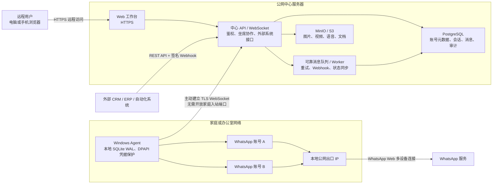

# RelayDesk

## 系统特色与核心能力

RelayDesk 是一套面向跨境销售、外贸客服和私域客户运营团队的自托管消息与成交工作台。系统把 WhatsApp、Facebook Messenger、客户资料、产品目录、报价订单、AI 翻译、素材、支付与跟进任务放在同一个界面中，帮助坐席从“收到咨询”一路完成“理解客户、推荐产品、发送目录、创建订单、发起收款和持续跟进”，减少在翻译工具、表格、图片编辑器和多个聊天窗口之间反复切换。

### 1. 快速合成并发送产品目录

- **团队共享产品库**：集中维护产品名称、唯一 SKU、描述、品牌、分类、供应商链接、内部备注、图片、重量、币种、Shipping Class、标签、规格变体及按采购数量变化的阶梯价格。产品资料可被所有有权限的坐席复用，修改产品库不会反向改写已经保存的历史订单。
- **批量导入、导出与维护**：支持通过 CSV 一键导入和导出产品；可批量调整价格、标签、分类、Shipping Class、标题和 SKU，适合快速整理规模化商品目录。
- **产品卡片即时生成**：坐席可在当前会话中搜索并多选产品，把实时产品资料合成为适合发送给客户的 PNG 产品卡片。卡片可包含产品图、名称、SKU、价格、阶梯价格、描述等信息，发送前仍可调整本次图片说明。
- **可视化卡片模板**：管理员或主管可配置产品卡片的画布尺寸、组件、顺序、样式和默认说明模板，使用 `{{productCount}}`、`{{productNames}}`、`{{productName}}`、`{{sku}}` 等变量统一团队输出，同时保留每次发送时的灵活性。
- **拼图式产品目录**：批量勾选产品后，可按可视化拼图模板自动排版并生成多页产品目录素材。模板支持产品图片、产品文字、自定义文字和背景等图层，能够调整位置、尺寸、层级及页面布局，无需坐席临时使用外部制图软件。
- **共享素材库**：生成后的目录图片会进入团队素材库，记录模板、产品快照、页数、创建人和创建时间，可预览单页、下载单图或打包下载 ZIP，方便团队长期复用同一套销售物料。
- **灵活发送方式**：从会话内打开素材库后，可跨多个素材批次选择最多 10 张图片，选择“逐个发送”，或按横向/竖向“拼接发送”；系统会保持素材库及页码顺序，并在进入可靠消息队列前确认处理结果。
- **多渠道交付**：产品卡片与目录既可通过 WhatsApp 发送，也可根据联系人保存的邮箱加入邮件发送队列；启用会话翻译后，随图说明可先自动翻译、预览确认，再与图片一起发给客户。

### 2. AI 双向翻译与多语言沟通

- **按会话独立设置语言**：每位坐席可为不同客户分别设置“客户语言”和“坐席语言”，偏好保存在服务端并跨浏览器同步，适合一个团队同时服务多个国家和地区。
- **来信保留原文并显示译文**：收到的文本、媒体说明和语音消息可翻译为坐席熟悉的语言；界面保留客户原文，并在其下方展示译文，便于核对语气、专有名词和上下文。
- **发信先预览、后发送**：坐席输入自己的语言后，系统先生成目标语言译文并允许人工修改；只有确认译文后，消息才会进入发送队列，避免未经检查的 AI 内容直接发给客户。
- **语音转写与翻译**：支持对收到的 WhatsApp 语音进行转写并翻译；OGG/Opus 等语音会在服务端临时转换为 Provider 支持的格式，原始媒体保持不变。转写原文和不同目标语言的译文会缓存，减少重复调用。
- **图片说明与业务内容翻译**：普通文字、产品卡片说明、素材目录说明、订单发送内容和 WhatsApp Status 文案都可以复用翻译预览流程，让多语言能力真正进入销售操作，而不只是单独的翻译窗口。
- **可替换 AI Provider**：管理员可配置 OpenAI 或同时兼容 `/chat/completions`、`/audio/transcriptions` 的服务，分别指定文字翻译与语音转写模型；API Key 使用系统数据加密密钥保存。
- **AI 文字转语音**：支持 OpenAI、ElevenLabs、Azure Speech 及 OpenAI-compatible TTS，将坐席输入的文字生成语音并作为 WhatsApp 语音消息发送；可配置模型、音色、语速和语气。若同时启用翻译，可先确认译文，再基于确认后的内容生成语音。

### 3. 从会话直接创建和发送订单

- **聊天内创建订单**：坐席无需离开客户会话即可创建订单草稿，可从团队产品库搜索商品，也可按需添加临时商品；支持多个商品、数量、阶梯单价、附加费用、客户可见说明和团队内部备注。
- **历史订单快照**：订单保存产品名称、SKU、单价等快照，后续产品库修改不会改变历史订单，便于追溯当时发送给客户的报价和成交条件。
- **地址与运费计算**：联系人可保存多个收货地址，创建订单时直接选择；系统可按产品重量、Shipping Class、目的国家或地区和运费模板计算建议运费，并允许坐席确认或调整。
- **多币种支持**：工作区可配置可用币种、基准币种和汇率，也可从公共汇率服务刷新汇率，为跨境报价和订单金额计算提供统一基础。
- **可配置订单编号**：管理员可以使用年份、月份、日期和当日序号变量定义订单编号规则，并指定业务时区；编号在订单创建时固化，规则变化不会影响历史订单。
- **多种订单发送格式**：订单可按文字、完整图片或 PDF 发送到会话，支持发送和重新发送。管理员可分别维护三种格式的模板、字段顺序、状态标题和展示内容，使报价单与订单通知保持统一品牌样式。
- **订单全局管理**：除联系人详情中的订单记录外，系统还提供集中订单列表，可搜索、筛选、查看详情、编辑订单、更新业务状态，并按最新订单状态筛选会话，例如未创建订单、待付款、已付款、处理中、已发货、已完成或已取消。
- **付款请求闭环**：可配置多个付款方式及付款 Profile。PayPal 订单能够生成付款链接、发送到 WhatsApp、刷新付款状态或按最新模板重新生成；手动付款方式可向客户发送预设付款说明，形成从报价到收款的连续流程。

### 4. 统一收件箱与客户关系管理

- **多账号、多渠道统一接待**：在同一个工作台处理本地 WhatsApp Web 账号、Meta WhatsApp Business Cloud API 账号和 Facebook Messenger Pages，会话仍按渠道及账号隔离权限和数据。
- **完整消息形态**：支持文本、图片、视频、语音和文件等媒体消息，并提供引用回复、发送中/已发送/已送达/已读/失败/待确认状态、失败消息人工重发及异常消息清理。
- **高效会话操作**：支持分页与实时增量更新、关键词搜索、日期范围、账号、标签、客户阶段和最新订单状态筛选；可收藏、认领、关闭、标记已读，并在同渠道账号之间转移会话及联系人关联。
- **客户 360° 资料**：联系人详情集中展示别名、电话和邮箱联系方式、主要邮箱、语言、标签、团队共享备注、个人提醒、生日、特殊日期、收货地址、订单历史、邮件活动、AI 会话摘要和已提取客户事实。
- **团队协作与权限**：提供管理员、主管和坐席角色、账号级访问范围、会话认领、共享标签与备注、个人提醒及审计记录，降低多人同时服务同一客户时的信息断层。
- **快捷回复与媒体复用**：快捷回复支持搜索、文本和媒体类型，可插入联系人等上下文变量；团队还可复用账号媒体库、产品卡、目录素材和订单模板，加快高频回复。

### 5. AI Agent、知识库与聊天记忆

- **按账号配置销售或客服 Agent**：可为每个 WhatsApp 账号单独设置人设、工作语言、营业时间、置信度阈值、跟进规则及允许使用的知识库。
- **企业知识库**：支持上传 PDF、DOCX、TXT、Markdown 和结构化常见问答；文档解析后通过 PostgreSQL/pgvector 建立混合检索索引，只有状态为可用的内容才会进入 Agent 上下文。
- **上下文感知回复**：Agent 可读取联系人资料、团队备注、聊天记忆、近期消息、订单摘要和授权知识，生成更贴近客户与当前交易阶段的回复或草稿。
- **人工接管与风险控制**：退款、支付、投诉升级、订单修改或置信度不足等情形不会自动回复；坐席发送消息后会进入人工接管，需明确恢复 Agent。自动发送能力按工具权限单独授权，默认优先采用人工审批。
- **持续客户记忆**：系统维护滚动会话摘要和带来源的客户事实；坐席可以修正、删除或重新整理记忆，同时完整历史消息仍保留在原始消息表中。

### 6. 任务、提醒与自动跟进

- **统一任务中心**：普通待办和定时消息共用列表、甘特图以及月/周/日历视图，可设置负责人、开始时间、截止时间、进度、重复规则和前置任务。
- **AI 个性化消息草稿**：定时消息可在执行前读取联系人资料、聊天记忆、近期消息、订单摘要和知识库，根据任务要求生成个性化草稿。
- **审批优先的自动化**：消息任务默认进入人工审批；只有主管或管理员明确授予 `queue_message` 工具权限后才允许自动加入发送队列。
- **生日、纪念日和节日运营**：Worker 可根据联系人生日、特殊日期和账号启用的内置节日提前创建任务，并在草稿生成时读取最新上下文，避免长期预生成文案过时。
- **个人提醒与客户跟进**：坐席可直接在会话中设置个人提醒，任务状态会与“我的提醒”协同展示，帮助团队持续跟进未付款、待确认或需要再次联系的客户。

### 7. 状态内容、素材与邮件触达

- **WhatsApp Status 管理**：可使用账号媒体库中的图片或视频创建状态内容，编写或翻译文案并安排发布时间，由后台 Worker 按计划发布和记录执行状态。
- **素材集中管理**：媒体文件统一进入对象存储，产品图片、拼图目录、会话附件、订单文件和状态素材可在对应业务流程中复用。
- **邮件补充触达**：系统支持 SMTP 与 Resend Provider，产品卡片或订单可发送到联系人一个或多个邮箱，并在会话资料中查看邮件活动，适合同时通过聊天和邮件交付正式资料。

### 8. 可靠发送、开放集成与自托管

- **离线可恢复的可靠队列**：发送请求会先持久化到 PostgreSQL，再派发给在线 Agent。Agent 或网络离线时消息保留在队列中，恢复后继续处理；`clientMessageId`、事件 ID 和 WhatsApp 消息 ID 用于幂等与去重。
- **明确处理不确定状态**：如果连接在 WhatsApp 可能已经接受消息、但 Agent 尚未取得确认的窗口中断，系统会标记为 `uncertain` 并停止自动重试，交由人工确认，避免客户收到重复消息。
- **边缘 Agent 架构**：Windows Agent 或 Linux Docker Agent 主动通过加密 HTTPS/WSS 连接中心服务器，家庭或办公室网络通常不需要公网 IP、端口映射或内网穿透；WhatsApp 会话凭据保留在 Agent 本地并受到平台加密机制保护。
- **REST API 与签名 Webhook**：外部 CRM、ERP 或自动化系统可使用 API Key 调用 `/api/v1`，消息发送支持稳定的客户端幂等 ID；Webhook 使用 HMAC-SHA256 签名、事件 ID 去重和失败重试机制。
- **自托管与数据掌控**：中心平台由 Web、API、Worker、PostgreSQL、Redis 和 MinIO/S3 组成，可通过 Docker Compose 部署；账号元数据、客户资料、消息、订单、任务、审计与媒体均由部署方自行管理。
- **安全配置**：Provider API Key、Meta 凭据和支付凭据加密保存，敏感值不会通过常规读取接口返回明文；系统提供角色权限、账号访问范围、设备凭据撤销、审计日志和受签名保护的 Webhook。

### 典型成交工作流

1. 客户通过 WhatsApp 或 Messenger 发来咨询，消息进入统一收件箱。
2. 系统按当前会话设置显示 AI 译文；坐席查看客户资料、历史摘要、标签、订单和提醒。
3. 坐席从产品库选择相关商品，快速生成产品卡片或多页拼图目录，并将说明翻译为客户语言后发送。
4. 客户确认商品后，坐席在会话内创建包含商品、数量、费用、地址、运费和付款方式的订单。
5. 系统按配置模板生成文字、图片或 PDF 订单并发送；需要在线收款时生成并发送 PayPal 付款链接。
6. 订单状态、付款进度和后续提醒持续保存在客户会话中；任务中心负责待办、定时跟进、生日和节日触达。

## 任务中心

RelayDesk 现在提供统一的普通任务与定时消息中心，包含列表、甘特图和月/周日历视图。消息任务可使用联系人资料、备注标签、聊天记忆、近期消息、订单摘要与已授权知识库生成个性化草稿；默认需要人工审批，只有主管或管理员明确授予 `queue_message` 权限后才可自动发送。

生日、联系人特殊日期及账号启用的内置节日会由 Worker 提前创建任务，并在草稿提前期到达后读取最新上下文。所有任务仍归属 WhatsApp 账号并使用 PostgreSQL、现有 Worker 和可靠出站队列；数据库升级由 `034_task_center.sql` 在 API 启动时自动应用。

> Windows Agent 的安装包发布、注册、扫码和断网恢复验收见 [`docs/windows-agent.md`](docs/windows-agent.md)。VPS 已上线后，建议先按该文档用测试 WhatsApp 账号完成一轮端到端验证，再接入正式账号。

## Docker Relay Agent

RelayDesk 也提供带浏览器管理界面的 Linux Docker Agent。每个容器只绑定一个 WhatsApp 账号，二维码、连接状态和重新配对操作可在本地网页完成；会话凭据和待同步事件会持久化在 Docker volume 中。

1. 在 RelayDesk 的 **设置 → Agent 管理** 生成一个 15 分钟有效的一次性注册码。
2. 在服务器上复制 `apps/agent/compose.yaml` 和 `apps/agent/.env.docker.example`，然后把示例文件另存为本地私有的 `.env`。不要直接修改仓库里的示例文件；`.env` 里至少填写 `RELAY_CENTRAL_URL`、`RELAY_ENROLLMENT_CODE`、`RELAY_ACCOUNT_ID` 和 `RELAY_MASTER_KEY`。
3. 执行 `docker compose pull && docker compose up -d`。
4. 管理界面默认只绑定服务器本机 `127.0.0.1:8788`。如果需要远程查看，请先通过 `ssh -L 8788:127.0.0.1:8788 <user>@<server>` 建立隧道，再在浏览器打开 `http://127.0.0.1:8788`。

完整部署、升级、代理和安全访问说明见 [`docs/docker-agent.md`](docs/docker-agent.md)。镜像由 GitHub Actions 发布到 `ghcr.io/samlau0086/relaydesk-agent:latest`。

## 远程连接方式与部署架构

RelayDesk 采用“公网中心服务器 + 家庭/办公室 Windows Agent”的边缘执行架构。你在外部访问中心服务器上的 Web 工作台，中心服务器负责身份验证、消息存储、API、队列和坐席协作；真正连接 WhatsApp 并执行收发操作的是家里或办公室电脑上的 Windows Agent。

Windows Agent 会主动向中心服务器建立加密的 HTTPS/WSS 出站连接，因此家庭网络通常不需要公网 IP、端口映射或内网穿透。只需确保 Windows Agent 能访问中心服务器，并保持后台运行。


```mermaid
flowchart LR
    U["远程用户<br/>电脑或手机浏览器"]

    subgraph CLOUD["公网中心服务器"]
        WEB["Web 工作台<br/>HTTPS"]
        API["中心 API / WebSocket<br/>鉴权、坐席协作、外部系统接口"]
        QUEUE["可靠消息队列 / Worker<br/>重试、Webhook、状态同步"]
        DB["PostgreSQL<br/>账号元数据、会话、消息、审计"]
        MEDIA["MinIO / S3<br/>图片、视频、语音、文档"]
        WEB --> API
        API --> QUEUE
        API --> DB
        QUEUE --> DB
        API --> MEDIA
    end

    subgraph HOME["家庭或办公室网络"]
        AGENT["Windows Agent<br/>本地 SQLite WAL、DPAPI 凭据保护"]
        WA1["WhatsApp 账号 A"]
        WA2["WhatsApp 账号 B"]
        WAN["本地公网出口 IP"]
        AGENT --> WA1
        AGENT --> WA2
        WA1 --> WAN
        WA2 --> WAN
    end

    META["WhatsApp 服务"]
    EXT["外部 CRM / ERP / 自动化系统"]

    U -->|"HTTPS 远程访问"| WEB
    EXT -->|"REST API + 签名 Webhook"| API
    AGENT -->|"主动建立 TLS WebSocket<br/>无需开放家庭入站端口"| API
    WAN -->|"WhatsApp Web 多设备连接"| META
```

### 消息流向

发送消息时：

1. 远程用户或外部系统把发送请求提交到中心 API。
2. 中心服务器先将消息和发送命令持久化，再通过 WSS 派发给对应的 Windows Agent。
3. Windows Agent 使用目标账号的本地 WhatsApp 会话完成发送，并把发送、送达、已读或失败状态同步回中心服务器。
4. 如果 Agent 或家庭网络离线，命令保留在中心队列；Agent 恢复连接后继续按顺序处理。

接收消息时：

1. WhatsApp 消息先到达运行对应账号的 Windows Agent。
2. Agent 先写入本地 SQLite WAL，再同步到中心服务器。
3. 中心服务器事务落库后确认同步游标，并实时更新 Web 工作台及签名 Webhook。
4. 如果中心服务器暂时不可达，Agent 会保留未确认事件并在恢复后重传；中心通过事件 ID 和 WhatsApp 消息 ID 去重。

### IP 归属

- WhatsApp 连接使用 Windows Agent 所在网络的公网出口 IP，而不是中心服务器 IP。
- 多个 WhatsApp 账号运行在同一台 Windows Agent 上时，通常共用该电脑所在网络的公网出口 IP。
- 账号分布在不同电脑、不同住宅或不同办公室网络时，会分别使用各自网络的出口 IP。
- 如需更强隔离，可以为不同账号部署独立 Agent、Windows 虚拟机或稳定的独立网络出口。
- 不建议频繁切换代理、地区或出口 IP；账号网络环境应尽量稳定并符合实际使用地点，以降低 WhatsApp 风控风险。

### 安全边界

- WhatsApp 会话凭据保存在 Windows Agent 本地，通过 Windows DPAPI 保护，不上传到中心服务器。
- Agent 只主动连接中心服务器，不监听公网端口；中心使用一次性注册码登记 Agent，并换取可撤销的设备凭据。
- 公网只需暴露经过 HTTPS/WSS 反向代理的 Web/API；PostgreSQL、Redis 和 MinIO 不应直接暴露到互联网。
- 中心服务器故障不会改变 WhatsApp 账号的网络出口，但会暂时影响远程操作；Agent 会继续保存待同步事件。
- Windows Agent 关机、退出登录或家庭断网期间无法实时收发；恢复后会处理仍可由 WhatsApp 多设备协议交付的事件和中心待发送队列。

### 推荐部署示例

```text
云服务器（固定域名 + HTTPS）
├─ RelayDesk Web / API / Worker
├─ PostgreSQL
├─ Redis
└─ MinIO

家里 Windows 电脑
└─ RelayDesk Agent
   ├─ WhatsApp 账号 A
   ├─ WhatsApp 账号 B
   └─ 主动连接 wss://relay.example.com/agent/ws

远程访问
└─ https://relay.example.com
```

RelayDesk 是一个自托管的 WhatsApp 与 Facebook Messenger 多账号消息聚合平台。它由中心 Web/API、持久任务 Worker、PostgreSQL、Redis、对象存储以及运行在 Windows 上的本地 WhatsApp Agent 组成。

> RelayDesk 同时支持本地 WhatsApp Web 多设备账号和 Meta 官方 Cloud API 账号。请只用于获得授权的业务会话，不要发送垃圾消息或未经同意的营销内容。

### Meta WhatsApp Business Cloud API

管理员可在“系统设置 → WhatsApp API”填写 WABA ID、Phone Number ID、长期 Access Token 和 Meta App Secret。凭据在 PostgreSQL 中加密保存，保存后不会通过 API 返回明文。

1. 在部署环境设置 `META_GRAPH_API_VERSION`（例如 `.env.example` 中的版本），生产环境缺少该变量时 API 会拒绝启动。
2. 添加账号后复制一次性显示的 Verify Token。
3. 在 Meta App 中将 Callback URL 设置为 `https://你的域名/api/v1/meta/whatsapp/webhook`，并订阅 WhatsApp 消息事件。
4. 完成 Webhook challenge 后，在设置页测试凭据并同步已审核模板。

Cloud API 新会话必须通过已审核模板发起。客户回复后会开启 24 小时服务窗口，窗口内可发送普通文本和媒体；窗口关闭后，RelayDesk 会在入队前阻止普通消息并引导坐席选择模板。

### Facebook Messenger Pages

推荐使用“系统设置 → Messenger Pages → 使用 Facebook 连接 Pages”的 OAuth 流程。管理员登录 Facebook 后可一次勾选多个 Page；RelayDesk 会读取并加密保存对应 Page Token、验证 Page 身份，并自动调用 `/{PAGE_ID}/subscribed_apps` 订阅消息事件。每个 Page 仍会成为独立渠道账号，拥有独立联系人、会话、权限和回复窗口，但会与 WhatsApp 一起显示在统一收件箱。

#### 准备条件

- 登录 [Meta for Developers](https://developers.facebook.com/apps/)，创建或选择一个已启用 Messenger 与 Facebook Login for Business 的 Meta App。
- 操作人必须拥有目标 Facebook Page 的管理权限，并能授权该 App 管理 Page 消息。
- 生产接收普通客户消息前，App 需要切换到 Live 模式，并按 Meta 要求完成业务验证、隐私政策及 `pages_messaging` 等权限审核。Development 模式通常只允许 App 角色和测试人员使用。
- RelayDesk API 必须能通过公网 HTTPS 访问；Meta 无法回调 `localhost`、内网地址或需要登录的 URL。

#### 首次配置 Facebook OAuth

1. 在 Meta App Dashboard 添加 **Facebook Login for Business**，创建一个 Login Configuration。
2. 在该 Configuration 中请求以下权限：
   - `pages_show_list`
   - `pages_messaging`
   - `pages_manage_metadata`
   - `pages_read_engagement`
3. 在 Facebook Login for Business 的 Valid OAuth Redirect URIs 中添加 RelayDesk 设置页显示的 OAuth Redirect URI，例如：
   - `https://你的 API 域名/api/v1/meta/messenger/oauth/callback`
4. 在 Meta App 的 Messenger Webhooks 中选择 `Page` 对象，填写 RelayDesk 显示的：
   - Callback URL：`https://你的 API 域名/api/v1/meta/messenger/webhook`
   - Verify Token：保存 OAuth 应用配置时 RelayDesk 一次性显示的值
5. 在 RelayDesk 的“系统设置 → Messenger Pages”填写：
   - **Meta App ID**：来自“App settings → Basic”
   - **Meta App Secret**：同一页面点击 Show 后取得
   - **Login for Business Configuration ID**：来自 Facebook Login for Business 的 Configuration
6. 保存后点击“使用 Facebook 连接 Pages”，使用拥有目标 Page 管理权限的 Facebook 账号登录，勾选一个或多个 Page，再在 RelayDesk 确认连接。

OAuth 回调只短暂使用 User Access Token 来读取 `/me/accounts`，不会长期保存它。候选 Page Token 在短期授权会话中加密保存，选定后才写入渠道账号；授权会话会过期并被清理。Page echo 通过 `messages` 字段返回，因此自动订阅的字段是 `messages`、`message_deliveries` 和 `message_reads`，不需要单独订阅已不适用的 `message_echoes` 字段。

#### Meta App 审核与上线

- App 处于 Development 模式时，通常只有 App 角色、测试人员及其可管理 Page 能完成授权和测试。
- 对外上线前，将 App 切换到 Live，完成 Meta 要求的业务验证、数据处理说明、隐私政策、服务条款和用户数据删除页面。
- 为上述 Page 权限申请 Advanced Access/App Review，并在审核说明中展示“Facebook 登录 → 选择 Page → 收发 Messenger 消息”的完整录屏。
- OAuth 不能替你在 Meta Dashboard 首次登记 Webhook Callback URL 和 Verify Token；这是 App 级别的一次性配置。后续新增 Page 会由 RelayDesk 自动完成 Page 订阅。

#### 手动凭据（仅作兼容回退）

如果 Meta App 暂时无法启用 Facebook Login for Business，可展开设置页中的“高级：手动添加 Page 凭据”，按以下方法逐 Page 添加。

1. **Page ID**
   - 打开目标 Facebook Page，在 Page 的“关于/About”或“Page transparency/主页透明度”区域查找数字 Page ID。
   - 也可以在 Meta App 的“Messenger → Messenger API Settings（Messenger API 设置）→ Access Tokens”区域连接 Page 后查看其 Page ID。
   - Page ID 是纯数字标识，不是 Page 用户名，也不是浏览器地址中的自定义短名称。

2. **Page Access Token**
   - 在 [Meta App Dashboard](https://developers.facebook.com/apps/) 打开对应 App。
   - 进入“Messenger → Messenger API Settings → Access Tokens”。
   - 点击“Add or remove Pages”，选择目标 Page 并完成 Facebook 授权。
   - 在目标 Page 行点击“Generate Token/生成 Token”，确认所需权限后立即复制生成的 **Page Access Token**。
   - 不要填写普通 User Access Token、App Access Token 或 WhatsApp Token。若 Meta 只签发短期 Token，应按 [Meta Access Token 文档](https://developers.facebook.com/docs/facebook-login/guides/access-tokens/)换成长效凭据后再用于生产。

3. **Meta App Secret**
   - 在同一个 Meta App 中进入“App settings/应用设置 → Basic/基本”。
   - 在“App Secret”旁点击“Show/显示”，通过账号验证后复制。
   - 多个 Page 使用同一个 Meta App 时可以使用同一个 App Secret；它用于验证 `X-Hub-Signature-256`，不能使用 App ID 代替。

4. **Webhook Verify Token**
   - Verify Token 不是从 Meta 获取的凭证。登录 RelayDesk 后进入“系统设置 → Messenger Pages → 高级：手动添加 Page 凭据”，填写渠道显示名称、Page ID、Page Access Token 和 Meta App Secret，然后点击添加。
   - RelayDesk 会生成并且只显示一次 Verify Token，请立即保存。遗失后可在该 Page 的管理项中重置，并同步更新 Meta Webhook 配置。

#### 配置 Meta Webhook

1. 在 RelayDesk 添加 Page 后，先点击“测试凭据”；确认 Page ID、Token 和 App Secret 属于同一 App/Page 配置。
2. 回到 Meta App Dashboard，进入 Messenger 的 Webhooks 设置并选择 `Page` 对象。
3. 填写以下内容：
   - Callback URL：`https://你的 API 域名/api/v1/meta/messenger/webhook`
   - Verify Token：RelayDesk 添加 Page 时一次性显示的 Verify Token
4. 点击“Verify and Save/验证并保存”，然后订阅 `messages`、`message_deliveries` 和 `message_reads`；message echo 会作为 `messages` 事件中的 `message.is_echo` 返回。
5. 确认目标 Page 已订阅到该 App；每个要接入的 Page 都需要授权、在 RelayDesk 中单独添加并完成 Page 订阅。
6. 从非管理员/非测试账号向 Page 发送一条消息，确认 RelayDesk 的“最近 Webhook 时间”已更新且统一收件箱出现 `Facebook · Page 名称` 会话。

凭据保存后 RelayDesk 不会通过 API 返回 Token 或 App Secret 明文。若 Page 管理员权限被移除、账号修改密码、App 权限被撤销或 Token 失效，请在 Meta 重新生成 Page Access Token，并在 RelayDesk 的 Page 设置中更新后再次测试。官方流程如有界面变化，以 [Messenger Platform 文档](https://developers.facebook.com/docs/messenger-platform/)和 [Meta Webhooks 文档](https://developers.facebook.com/docs/graph-api/webhooks/)为准。

Messenger 不允许 RelayDesk 主动创建客户会话。首版支持文本、图片、视频、音频、文件、引用回复和送达/已读状态；不处理 quick reply、postback、reaction 或 referral。

## 已实现能力

- 中文四栏共享收件箱，会话筛选、搜索、联系人详情、新建单个号码会话、离线状态与发送排队反馈。
- 多坐席角色、账号权限、联系人、会话、消息、回执、标签、备注和审计数据模型。
- `/api/v1` 登录、账号/会话/消息查询、幂等发送、媒体上传、API Key、Webhook 和 Agent 注册接口。
- Web 左侧 Agent 管理页可查看设备版本、协议、在线状态、同步游标与绑定账号，并支持注册、重命名、撤销和删除。
- 中心与 Agent 的版本化 WebSocket 协议；PostgreSQL 发件箱与本地 SQLite WAL 共同提供至少一次传输和幂等落库。
- Windows Electron Agent、DPAPI 保护的本地主密钥、按账号子进程、扫码配对、断网重连和串行发送。
- Webhook HMAC-SHA256 签名、24 小时重试、人工重放；不确定发送会停止自动重试以避免重复消息。
- Docker Compose 单节点部署、健康检查、PostgreSQL/MinIO 持久卷和备份脚本。

## 本地启动

### 工作台预览

工作台不再注入演示账号、联系人或消息。页面必须登录中心 API，并只展示 PostgreSQL 中由 Windows Agent 同步的真实数据；没有会话时会显示真实空状态。若 Web 与 API 不同域，请在构建 Web 时设置 `NEXT_PUBLIC_RELAY_API_URL`，同时确保 API 的 `CORS_ORIGIN` 指向工作台域名。

历史版本曾通过 `002_seed_demo.sql` 写入 `Pharah House` 等演示记录。当前版本已移除该种子，并在中心 API 启动时自动删除这些固定 ID 的旧记录；不会删除真实账号或消息。

```powershell
npm install
npm run dev
```

访问 `http://localhost:3000`。

### 完整中心平台

复制 `.env.example` 为 `.env`，替换所有密码和密钥，然后执行：

```powershell
docker compose up --build -d
```

- 工作台：`http://localhost:3200`
- API：`http://localhost:8080`
- 健康检查：`http://localhost:8080/health`
- OpenAPI：`http://localhost:8080/api/v1/openapi.json`

首次启动会使用 `.env` 中的 `ADMIN_EMAIL` 和 `ADMIN_PASSWORD` 创建管理员。

### AI Agent、知识库与聊天记忆

管理员可在“系统设置 → AI Agent”中配置独立的 OpenAI/OpenAI-compatible Provider，并为每个 WhatsApp 账号设置人设、语言、营业时间、置信度阈值、24/72 小时跟进规则和可用知识库。功能默认关闭；只有完成 Provider 与知识库配置并明确开启账号后才会运行。

“系统设置 → 知识库”支持 PDF、DOCX、TXT、Markdown 和结构化常见问答。原始文档保存在 MinIO，后台 Worker 解析并通过 PostgreSQL/pgvector 建立混合检索索引。状态显示为“可用于回答”后，文档才会进入 Agent 上下文；删除文档或问答会同步移除检索内容。

Agent 只会在置信度达标、引用有效知识且不涉及退款、支付、投诉升级或订单修改时自动发送。其余结果会作为坐席草稿展示。坐席发送任何消息后，该会话进入人工接管并取消待跟进任务，必须在会话顶部手动点击“恢复 Agent”。客户回复、会话关闭/归档、成交或流失也会取消后续跟进。

联系人详情会展示滚动会话摘要和带来源的客户事实。事实可由坐席修改或删除；“重新整理”会排队重建摘要。完整消息历史仍保存在原有 `messages` 表中。

数据库升级会在 API 启动时自动应用 `014_ai_agent.sql`。部署使用带 pgvector 的 PostgreSQL 17 镜像；现有数据库卷会原地新增表和索引，不会清除历史会话。

### AI 双向翻译

管理员进入“系统设置 → AI 翻译”后，可配置 OpenAI 或同时实现 `/chat/completions`、`/audio/transcriptions` 的 OpenAI 兼容服务，并分别指定文字翻译与语音转写模型。OpenAI 的默认语音转写模型为 `gpt-4o-mini-transcribe`。翻译与文字转语音 Provider 相互独立；翻译服务同一时间只允许启用一个 Provider，API Key 使用 `DATA_ENCRYPTION_KEY` 加密保存，仅经过身份验证的管理员可在设置页重新载入、显示或复制。

坐席可在会话输入区附件按钮右侧为当前会话开启 AI 翻译，并分别选择“收到消息译为”和“发送消息译为”的语言。每个会话拥有独立配置，偏好按“坐席 + 会话”保存在 PostgreSQL 中，会随同一坐席账号跨浏览器同步。收到的纯文本保留原文并在下方显示译文；收到的语音可从播放器下方手动触发转写与翻译，WhatsApp 的 OGG/Opus 语音会在服务端临时转为 Provider 支持的 MP3，原始媒体保持不变。文字译文按“消息 + 目标语言”缓存，语音转写按消息缓存且译文同样按目标语言缓存，跨浏览器不会重复调用已生成结果。发出文本先生成可编辑预览，只有确认后才会进入可靠消息队列。附件说明、图片 OCR 和新建会话首条消息不会自动翻译。

### AI 文字转语音

管理员登录 Web 工作台后，进入左下角“系统设置 → AI 语音 Provider”配置服务。当前支持 OpenAI、ElevenLabs、Azure Speech，以及实现 `/audio/speech` 的 OpenAI 兼容接口。API Key 使用 `DATA_ENCRYPTION_KEY` 加密保存到 PostgreSQL，仅经过身份验证的管理员可在设置页重新载入、显示或复制；不需要在 `.env` 中保存 Provider API Key。

进入任意会话后，点击输入框右侧的麦克风按钮，可以输入最多 4096 个字符并设置语速和语气。中心 API 会通过当前启用的 Provider 生成 OGG/Opus 或 MP3 音频、保存到媒体库，再通过现有的可靠消息队列交给 Windows Agent；Agent 会将它作为 WhatsApp 语音消息发送。系统同一时间只允许启用一个 Provider。

### Windows Agent

Agent 安装包以 `apps/agent/package.json` 的版本为准。版本文件合入 `main` 后，GitHub Actions 会构建并校验安装包内的版本徽标、renderer、preload 桥接和固定用户数据目录，然后自动创建对应的 `agent-v*` GitHub Release。不要从旧 Release 下载 `v0.1.0/v0.1.1`；已注册设备的 SQLite、凭据和账号数据固定保存在 `%APPDATA%\@relaydesk\windows-agent`，覆盖升级不会清除。

```powershell
cd apps/agent
npm install
npm run dev
```

管理员登录 Web 工作台后，点击左下角“设置”，即可创建 15 分钟有效的一次性注册码。也可以直接调用 `POST /api/v1/agents/enrollment`。把注册码粘贴到 Agent，注册后即可添加 WhatsApp 账号并扫码。

生成 Windows 安装包：

```powershell
cd apps/agent
npm ci
npm run package:win
```

安装包输出到 `apps/agent/release/`。推送 `agent-v<package.json version>` 标签会由 GitHub Actions 构建安装包、生成 SHA-256 校验文件并创建 GitHub Release；详细发布和测试流程见 [`docs/windows-agent.md`](docs/windows-agent.md)。

## 外部系统调用

创建 API Key 后，以 `Authorization: Bearer rdk_...` 调用接口。发送消息必须提供已有账号、已有会话和稳定的 `clientMessageId`：

```bash
curl -X POST http://localhost:8080/api/v1/messages \
  -H "Authorization: Bearer $RELAY_API_KEY" \
  -H "Content-Type: application/json" \
  -d '{
    "accountId":"10000000-0000-4000-8000-000000000001",
    "conversationId":"30000000-0000-4000-8000-000000000001",
    "clientMessageId":"crm-order-20260713-001",
    "type":"text",
    "text":"您好，您的订单已经发出。"
  }'
```

成功返回 `202 Accepted`。相同账号和 `clientMessageId` 重试时返回同一平台消息，不会重复排队。

Web 工作台点击“消息中心”标题右侧的 `+` 可以新建单个号码会话。号码必须包含国家或地区代码；中心会创建或复用联系人与会话，并将首条文本消息写入可靠发送队列。该入口不支持一次提交多个号码。

Webhook 请求包含：

- `x-relay-event-id`：全局事件 ID；接收方应据此去重。
- `x-relay-timestamp`：Unix 时间戳。
- `x-relay-signature`：`sha256=HMAC(secret, timestamp + "." + rawBody)`。

## 可靠性边界

Agent 收到的 WhatsApp 事件先写入本地 SQLite WAL，中心事务提交后才确认游标；每条事件携带原始游标，重复批次通过 Agent 游标、事件 ID 以及 `(account_id, whatsapp_message_id)` 唯一约束消除。发送命令先写 PostgreSQL，只有 Agent 与对应 WhatsApp 账号都在线时才派发；断线前明确未执行的命令会恢复为 `queued`，不会标记失败。若进程在 WhatsApp 可能已经接受消息后中断，则标记为 `uncertain` 并要求人工确认。

中心按事件逐条事务提交并返回连续确认游标，单条异常不会回滚整批或阻塞后续回复；无正文的 WhatsApp 协议占位事件会被安全忽略。Agent 会在本机加密保存近期已发送消息内容，供 WhatsApp 的消息重试请求使用，避免接收端长期显示“正在等待此消息，这可能需要一段时间”。

首次扫码的历史消息只按 WhatsApp 多设备协议实际提供的范围尽力导入。系统无法保证 WhatsApp 从未向关联设备投递的消息，也无法保证完整旧历史。

## 目录

- `app/`：Web 工作台。
- `services/api/`：中心 API、Agent WebSocket 与后台 Worker。
- `apps/agent/`：Windows Electron Agent。
- `packages/protocol/`：中心与 Agent 的版本化协议类型。
- `infra/postgres/`：数据库迁移。
- `compose.yaml`：单节点生产部署。

## 上线检查

GitHub Actions 自动部署到 VPS 的准备步骤、Secrets 配置、HTTPS 反向代理和回退说明见 [`docs/vps-deployment.md`](docs/vps-deployment.md)。

1. 更换 `.env` 的数据库、JWT、数据加密、管理员和对象存储密钥。
2. 使用 HTTPS 反向代理暴露 Web/API，并限制 MinIO 与 PostgreSQL 只在内部网络访问。
3. 运行数据库与对象存储备份，完成一次恢复演练。
4. 先用测试 WhatsApp 账号灰度验证固定 Baileys 版本，再接入正式账号。
5. 配置 Agent 离线、账号掉线、发送失败、Webhook 积压、磁盘容量和备份失败告警。
