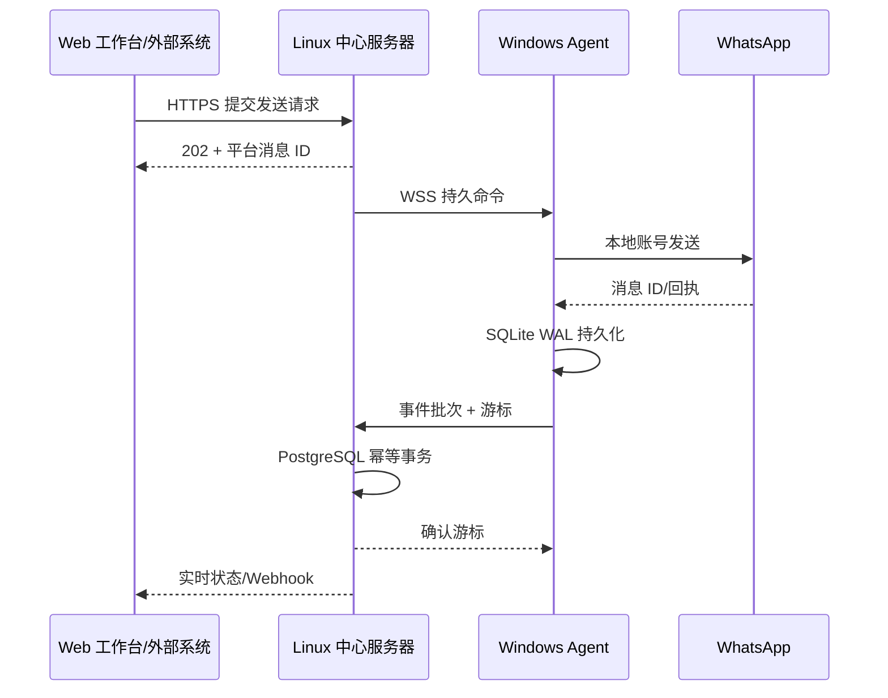

# Windows Agent 发布与端到端验收

VPS 一键部署完成后，下一步应先打通一台 Windows Agent 和一个专用测试 WhatsApp 账号。不要直接接入正式业务账号；当前 Agent 基于 WhatsApp Web 多设备协议，必须先验证固定版本在你的网络和账号环境下是否稳定。

## 1. 网络拓扑与前置条件

Agent 只向公网中心主动建立 HTTPS/WSS 出站连接，家里或办公室无需公网 IP，也无需开放路由器端口。WhatsApp 流量从 Windows 所在网络直接发往 WhatsApp，中心服务器不保存 WhatsApp 会话密钥。



安装前确认：

- Windows 10/11 x64，系统时间同步，磁盘至少预留 2 GB。
- Windows 可通过浏览器访问中心平台的公网 HTTPS 地址。
- 反向代理必须支持 `/agent/ws` 的 WebSocket Upgrade，并使用受信任的 TLS 证书。
- 准备一个非关键业务的 WhatsApp 测试账号及手机，手机端可打开“设置 → 关联设备”。
- Windows 不应休眠；Agent 关闭窗口后留在托盘，只有托盘菜单“退出”才会停止。

## 2. 构建安装包

本机构建：

```powershell
cd apps/agent
npm ci
npm run package:win
Get-ChildItem release
```

输出目录为 `apps/agent/release/`，主安装包名称形如 `RelayDesk-Agent-0.1.0-x64.exe`。当前安装包未做商业代码签名，Windows SmartScreen 可能提示未知发布者；生产分发前应配置 EV/OV 代码签名证书，并在干净的 Windows 虚拟机上复验安装和升级。

## 3. GitHub Actions 发布

`.github/workflows/agent-release.yml` 提供两种入口：

- Actions 页面手动运行 `Build Windows Agent`：构建未签名安装包并保存 14 天的 workflow artifact，适合内部测试。
- 推送版本标签：校验标签与 `apps/agent/package.json` 的版本一致，构建安装包、生成 `SHA256SUMS.txt`，并创建 GitHub Release。

发布 `0.1.1` 示例：

```powershell
git tag agent-v0.1.1
git push origin agent-v0.1.1
```

升级版本时先修改 `apps/agent/package.json` 和 lockfile，完成兼容测试后再创建对应标签。不要让 Agent 自动跨版本升级 Baileys；每个版本都应使用测试账号观察后再灰度分发。

## 4. 首次注册和扫码

1. 在中心后台创建一次性 Agent 注册码；若暂时没有管理界面，可由管理员凭据调用 `POST /api/v1/agents/enrollment`。
2. 安装并打开 RelayDesk Agent，中心地址填写公网 HTTPS 根地址，例如 `https://relay.example.com`，不要填写 VPS 内网容器地址。
3. 输入设备名和一次性注册码完成注册。状态应从“离线”变为“已连接”。
4. 点击“添加账号”，输入便于识别的测试账号名称。
5. 手机 WhatsApp 打开“关联设备”并扫描 Agent 窗口中的二维码。
6. Agent 账号状态应变为 `online`，中心工作台应显示同一账号在线。
7. 点击“生成并复制”保存诊断信息；其中不得出现注册码、设备凭据或 WhatsApp 会话密钥。

注册失败时依次检查：中心地址是否为 HTTPS 根地址、证书是否受信任、注册码是否在 15 分钟有效期内、反向代理是否把 `/api/` 和 `/agent/ws` 转发到 API 服务。

## 5. 最小端到端验收

按顺序执行并记录平台消息 ID、WhatsApp 消息 ID、时间和结果：

1. 从另一 WhatsApp 账号给测试账号发送一条唯一文本，确认 5 秒内出现在工作台且只出现一次。
2. 在工作台回复唯一文本，确认手机收到，平台状态从 `queued` 进入 `sent`，随后能更新送达/已读状态。
3. 分别收发图片和文档，核对文件大小、MIME 类型及内容。
4. 使用同一个 `clientMessageId` 连续调用两次 `POST /api/v1/messages`，确认返回同一平台消息且 WhatsApp 只收到一次。
5. 配置测试 Webhook，确认签名可校验；让接收端临时返回 500，再恢复 2xx，确认系统重试且事件 ID 不变。
6. 关闭并重开 Agent，确认 DPAPI 保护的会话可恢复，无需重新扫码。

验收通过标准：正常网络下 95% 新消息在 Agent 收到后 5 秒内进入工作台；所有测试消息最终无丢失、无重复入库；明确失败与不确定结果能区分显示。

## 6. 断网和崩溃恢复测试

### Windows 到中心断网

1. 保持 WhatsApp 网络可用，仅通过防火墙临时阻断中心服务器域名/端口。
2. 向测试账号发送多条带序号消息。
3. 在 Agent 诊断中确认 `pendingEvents` 增长。
4. 恢复网络，等待 `centralConnection` 为 `online` 且 `pendingEvents` 回到 0。
5. 在中心按序号核对消息完整且不重复，并确认 `lastAckedCursor` 单调增加。

### Agent 强制重启

1. 在有本地待同步事件时从任务管理器结束 Agent，或重启 Windows。
2. 重新启动后确认账号和中心连接自动恢复。
3. 等待诊断队列清空，并核对重启前后的消息没有丢失或重复。

### 慢网和连接抖动

使用 Windows 网络限速工具模拟高延迟和丢包，连续发送小批量文本及媒体。确认 Agent 会指数退避重连，单账号异常不影响其他账号；媒体中断后能够校验并继续，而不是把损坏文件标记为成功。

不要在“WhatsApp 可能已接受发送、但 Agent 未取得回执”的窗口自动重发。此时平台应标记 `uncertain`，由人工在手机和会话记录中确认后决定后续动作。

## 7. 生产灰度顺序

1. 测试账号连续运行至少 48 小时。
2. 接入 1 个低风险真实账号观察，再逐步扩到 3、5、10 个账号。
3. 每次扩容前检查 Agent 离线率、待同步事件数、发送失败/不确定结果、VPS 磁盘和备份状态。
4. 同一 Windows 上的账号共用当地公网出口 IP；需要网络或故障隔离的账号应放到不同 Windows/VM 和稳定网络。
5. Baileys 或 Electron 升级必须单独发 Agent 版本，先测试账号、再小批量、最后全量。

## 8. 当前发布边界

- GitHub Release 产物目前是未签名 x64 NSIS 安装包，尚未实现静默自动升级。
- Agent 会显示自身版本、协议版本、中心状态、账号状态、本地积压和确认游标。
- 扫码二维码在本机生成，不依赖第三方二维码服务。
- 首版不采集或发送群聊，不提供群发能力。
- 平台只能保证已被 WhatsApp 协议交付到 Agent 的事件可持久同步，不能保证上游从未交付的数据。
